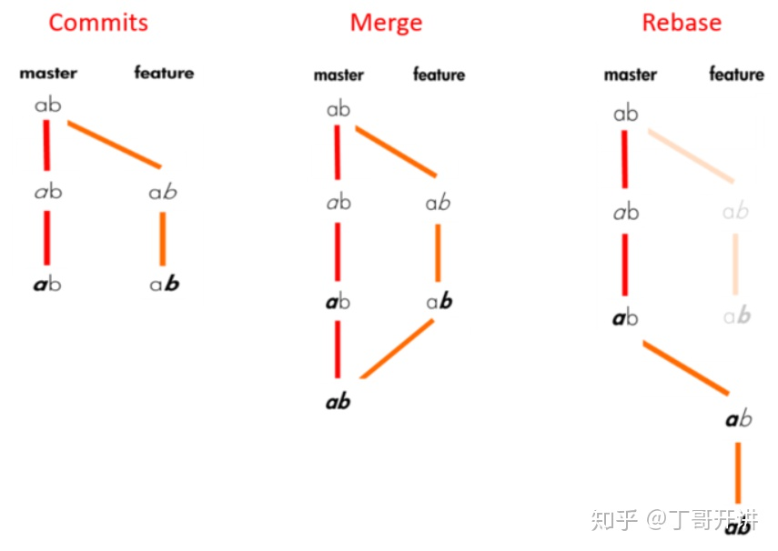
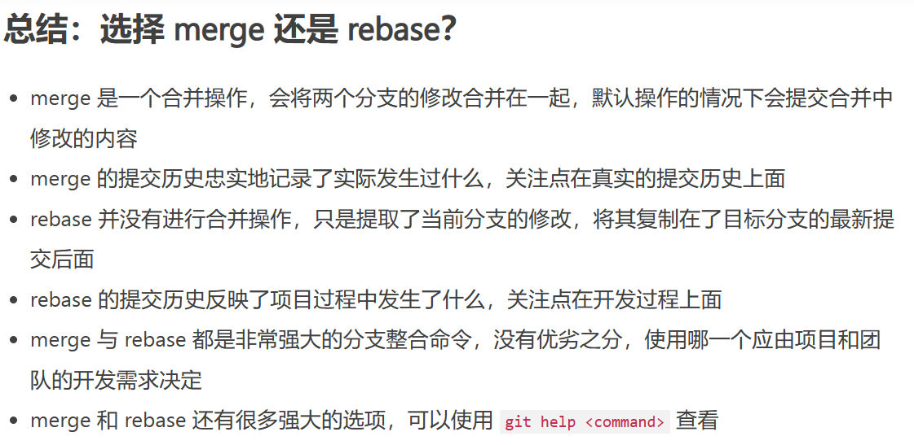

# Git

- Git 仓库中的提交记录保存的是你的目录下所有文件的快照。

- 在你每次进行提交时，它并不会盲目地复制整个目录。条件允许的情况下，它会将当前版本与仓库中的上一个版本进行对比，并把所有的差异打包到一起作为一个提交记录。

- 提交记录非常轻量，可以快速地在这些提交记录之间切换！

## 提交记录

- 修改代码库，并把这些修改保存成了一个提交记录`git commit`
- 对上一次提交有修改，可以修改文件也可以修改说明，不产生新的commit：`git commit --amend`

## 分支

- Git 的分支也非常轻量。它们只是简单地指向某个提交纪录

- 即使创建再多的分支也不会造成储存或内存上的开销，并且按逻辑分解工作到不同的分支要比维护那些特别臃肿的分支简单多了。

### 创建/切换分支

- 创建新分支`git branch <name>`
- 切换到分支`git checkout <name>`

- 创建一个新的分支同时切换到新创建的分支的话，可以通过 `git checkout -b <your-branch-name>` 来实现。

### 合并分支

- 将两个分支合并到一起。就是说我们新建一个分支，在其上开发某个新功能，开发完成后再合并回主线。

- 在当前分支下使用`git merge <name>`，将name分支合并到当前分支
- 在当前分支下使用`git rebase <name>`，将自己复制到name为父类的分支上





关于 merge 与 rebase 的讨论。以下是关于 rebase 的优缺点：

优点:

- Rebase 使你的提交树变得很干净, 所有的提交都在一条线上

缺点:

- Rebase 修改了提交树的历史

比如, 提交 C1 可以被 rebase 到 C3 之后。这看起来 C1 中的工作是在 C3 之后进行的，但实际上是在 C3 之前。

一些开发人员喜欢保留提交历史，因此更偏爱 merge。而其他人（比如我自己）可能更喜欢干净的提交树，于是偏爱 rebase。

## 检查记录

- HEAD 总是指向当前分支上最近一次提交记录。大多数修改提交树的 Git 命令都是从改变 HEAD 的指向开始的。

- 也就Head指向**当前指向的记录**

- 每次checkout的时候 head会跟着改变

## 相对引用

- 使用 `^` 向上移动 1 个提交记录:
  - `git checkout HEAD^`到当前提交的父提交
  - `git checkout <name>^`到name提交的父提交
  - `^3`当之前有多个父节点，可在^后添加数字来选择指定父节点
- 使用 `~<num>` 向上移动多个提交记录，如 `~3`

## 移动分支

- 可以直接使用 `-f` 选项让分支指向另一个提交。`git branch -f A B`将分支A强制转移到B上

## 撤销

- 主要有两种方法用来撤销变更 —— 一是 `git reset`，还有就是 `git revert`
- reset用在本地分支，revert用在远程分支

- `git reset` 通过把分支记录回退几个提交记录来实现撤销改动。你可以将这想象成“改写历史”。`git reset` 向上移动分支，原来指向的提交记录就跟从来没有提交过一样。在reset后， 所做的变更还在，但是处于未加入暂存区状态。

- 为了撤销更改并**分享**给别人，我们需要使用 `git revert`。要撤销的提交记录后面多了一个新提交！这是因为新提交记录 `C2'` 引入了**更改** —— 这些更改刚好是用来撤销 `C2` 这个提交的。也就是说 `C2'` 的状态与 `C1` 是相同的。

## 整理提交记录

- 已知提交记录的Hash，将一些提交复制到当前所在的位置（`HEAD`），使用`git cherry-pick <提交号>...`

- 未知提交记录的Hash，从一系列的提交记录中找到想要的记录，使用交互式rebase
  - 交互式 rebase 指的是使用带参数 `--interactive` 的 rebase 命令, 简写为 `-i`
  - 如果你在命令后增加了这个选项, Git 会打开一个 UI 界面并列出将要被复制到目标分支的备选提交记录，它还会显示每个提交记录的哈希值和提交说明，提交说明有助于你理解这个提交进行了哪些更改。

当 rebase UI界面打开时, 你能做3件事:

- 调整提交记录的顺序（通过鼠标拖放来完成）
- 删除你不想要的提交（通过切换 `pick` 的状态来完成，关闭就意味着你不想要这个提交记录）
- 合并提交。

## 标签

- `git tag <tag> <name>`不会随着新的提交而移动。你也不能切换到某个标签上面进行修改提交，它就像是提交树上的一个锚点，标识了某个特定的位置。
- `git describe`用来**描述**离你最近的标签

## 创建远程仓库

- `git clone` 命令在真实的环境下的作用是在**本地**创建一个远程仓库的拷贝（比如从 github.com）。 也可用于帮我们把远程仓库和本地仓库关联起来，在远程创建一个你本地仓库的副本。

## 从远程仓库获取数据

- 当我们从远程仓库获取数据时, 远程分支也会更新以反映最新的远程仓库。

- `git fetch` 完成了仅有的但是很重要的两步:

  - 从远程仓库下载本地仓库中缺失的提交记录

  - 更新远程分支指针(如 `o/main`)
  - 实际上将本地仓库中的远程分支更新成了远程仓库相应分支最新的状态。

## 更新本地仓库

- 用 `git fetch` 获取远程的数据, 用`git pull`将这些变化更新到我们的工作当中。

- `git pull` 就是 git fetch + git merge

## 上传变更

- `git push` 负责将**你的**变更上传到指定的远程仓库，并在远程仓库上合并你的新提交记录

## 历史偏离问题

> 假设你周一克隆了一个仓库，然后开始研发某个新功能。到周五时，你新功能开发测试完毕，可以发布了。但是 —— 天啊！你的同事这周写了一堆代码，还改了许多你的功能中使用的 API，这些变动会导致你新开发的功能变得不可用。但是他们已经将那些提交推送到远程仓库了，因此你的工作就变成了基于项目**旧版**的代码，与远程仓库最新的代码不匹配了。
>
> 这种情况下, `git push` 就不知道该如何操作了。如果你执行 `git push`，Git 应该让远程仓库回到星期一那天的状态吗？还是直接在新代码的基础上添加你的代码，亦或由于你的提交已经过时而直接忽略你的提交？
>
> 因为这情况（历史偏离）有许多的不确定性，Git 是不会允许你 `push` 变更的。实际上它会强制你先合并远程最新的代码，然后才能分享你的工作。

plan1：用 `git fetch` 更新了本地仓库中的远程分支，然后用 rebase 将我们的工作移动到最新的提交记录下，最后再用 `git push` 推送到远程仓库。简写为`git pull --rebase; git push`

plan2：用 `git fetch` 更新了本地仓库中的远程分支，然后**合并**了新变更到我们的本地分支（为了包含远程仓库的变更），最后我们用 `git push` 把工作推送到远程仓库

## 远程服务器拒绝!(Remote Rejected)

> 远程服务器拒绝直接推送(push)提交到main, 因为策略配置要求 pull requests 来提交更新.
>
> 你应该按照流程,新建一个分支, 推送(push)这个分支并申请pull request,但是你忘记并直接提交给了main.现在你卡住并且无法推送你的更新.

- 解决方法：新建一个分支feature, 推送到远程服务器. 然后reset你的main分支和远程服务器保持一致, 否则下次你pull并且他人的提交和你冲突的时候就会有问题.

## 远程追踪

- 方法1：使用`git checkout -b totallyNotMain o/main`就可以创建一个名为 `totallyNotMain` 的分支，它跟踪远程分支 `o/main`

- 方法2：使用：`git branch -u` 命令，执行：

  ```
  git branch -u o/main foo
  ```

  这样 `foo` 就会跟踪 `o/main` 了。如果当前就在 foo 分支上, 还可以省略 foo：

  ```
  git branch -u o/main
  ```

## 一些参数

- 修改指定位置的分支

`git push <remote> <place>`

`git pull origin <remoteName>:<localName>`

`git fetch origin <remoteName>:<localName>` 