# Lua特性

- 扩展性强
- 简明高效
- 可移植性强

# 保留字

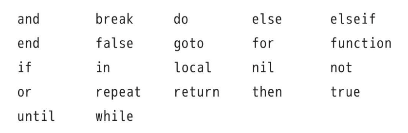

- Lua语言是对大小写敏感的，因而虽然and是保留字，但是And和AND就是两个不同的标识符。

# 注释

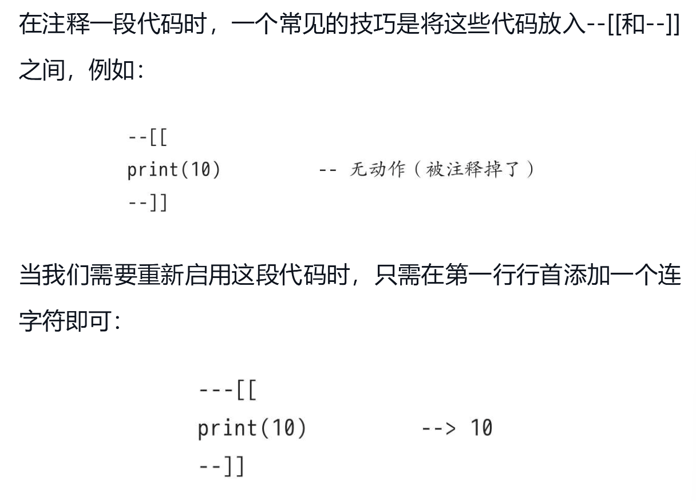

# 分隔符

- 在Lua语言中，连续语句之间的分隔符并不是必需的，如果有需要的话可以使用分号来进行分隔。

- 下面的情况等价


# 基本类型

- Lua语言中有8种基本类型：nil（空）、boolean（布尔）、number（数值）、string（字符串）、userdata（用户数据）、function（函数）、thread（线程）和table（表）。

- userdata类型允许把任意的C语言数据保存在Lua语言变量中。

## nil

- 一个全局变量在第一次被赋值前的默认值就是nil，而将nil赋值给全局变量则相当于将其删除。

## boolean

- 在Lua语言中，条件测试（例如控制结构中的分支语句）将除Boolean值false和nil外的所有其他值视为真。特别的是，在条件检测中Lua语言把零和空字符串也都视为真。

## 逻辑运算

- Lua语言支持常见的逻辑运算符：and、or和not。和条件测试一样，所有的逻辑运算将Boolean类型的false和nil当作假，而把其他值当作真。
- 逻辑运算符and的运算结果为：如果它的第一个操作数为“false”，则返回第一个操作数，否则返回第二个操作数。
- 逻辑运算符or的运算结果为：如果它的第一个操作数不为“false”，则返回第一个操作数，否则返回第二个操作数。

## 数值

- 当需要区分整型和浮点型的值，可以用`math.type`

- 整型+0.0=浮点型
- 浮点型|0=整型 或者 math.tointeger

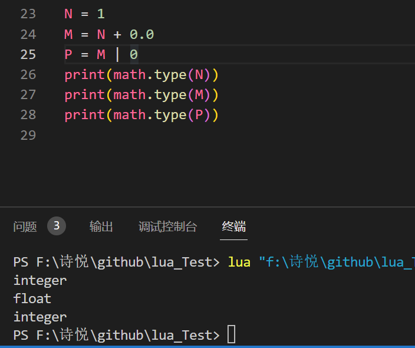

## 运算符

### 优先级

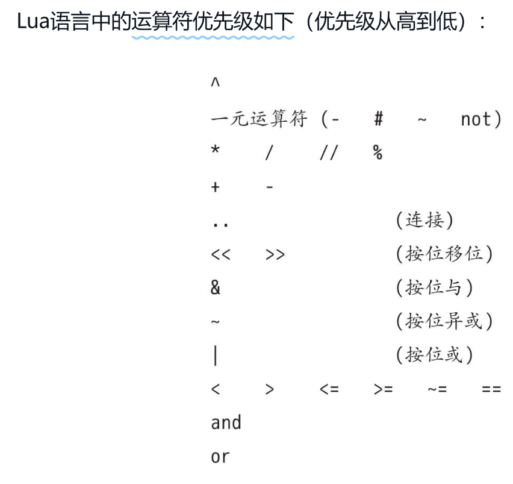

### 结合性

- 在二元运算符中，除了幂运算和连接操作符是右结合的外，其他运算符都是左结合的。

- `x^y^z`等价于`x^(y^z)`

# 字符串

- `#`获取字符串长度，等价于`string.len(s)`
- `..`连接字符串
- 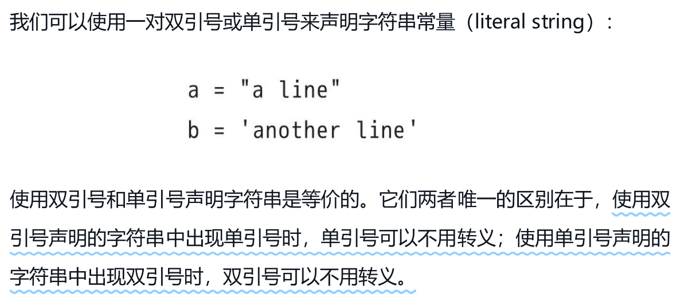

- 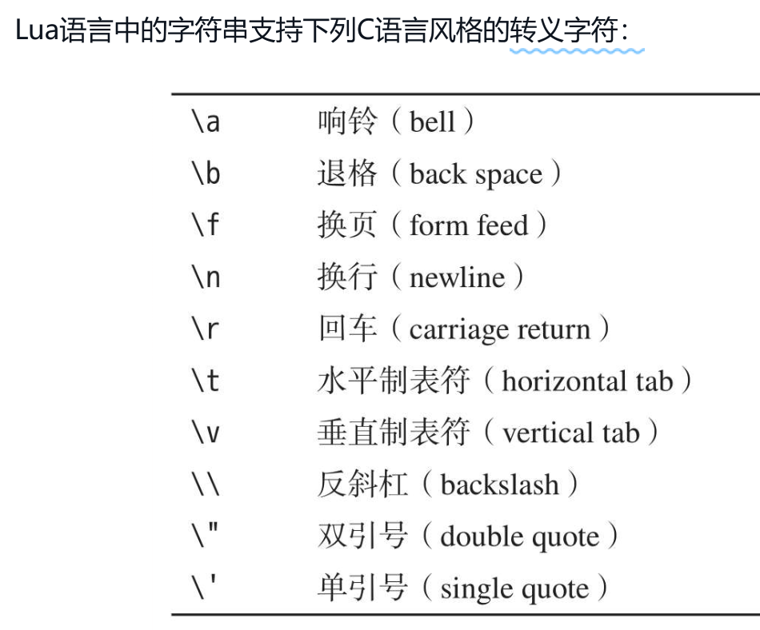

- 像长注释/多行注释一样，可以使用一对双方括号来声明长字符串/多行字符串常量。被方括号括起来的内容可以包括很多行，并且内容中的转义序列不会被转义。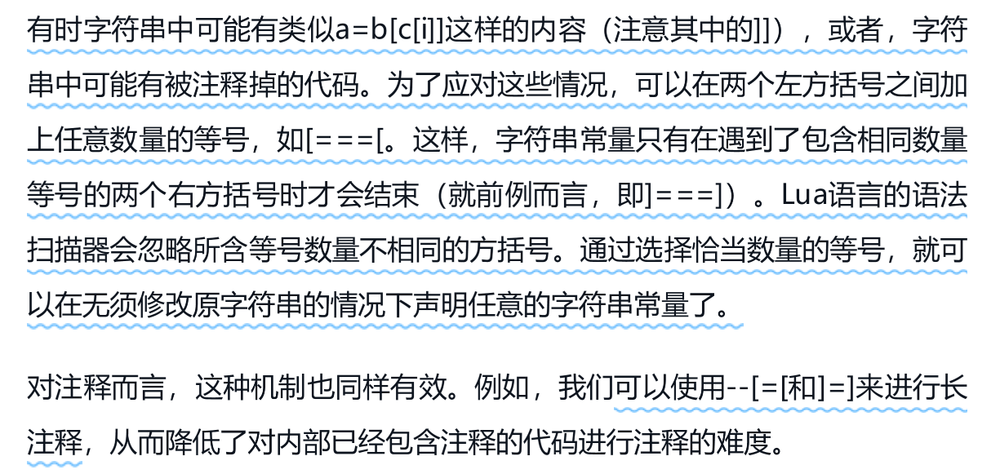

- 字符串和数字可以自动转换
- 字符串显示转换为数字：`tonumber("10",10)`，第二个参数为**进制**
- 数字显示转换为字符串：`tostring(10)`

- 重复字符串n次：`string.rep(s,n)`
- 反转字符串：string.reverse(s)
- 全部变小写/大写：`string.lower(s)  string.upper(s)`

- 提取部分字符串：`string.sub(s, i, j)`
  - 对字符串s调用函数string.sub（s,1,j）得到的是字符串s中长度为j的前缀
  - 调用string.sub（s,j,-1）得到的是字符串s中从第j个字符开始的后缀
  - 调用string.sub（s,2,-2）返回的是去掉字符串s中第一个和最后一个字符后的结果
- 字符串和数值转换：` string.char()  string.byte() `
- 函数string.format是用于进行字符串格式化和将数值输出为字符串
- 查找子字符串：`string.find()`
- 替换子字符串：`string.gsub("dada", "a", ".")` ，表示用 . 替换 a

# 表

- 表永远是匿名的，表本身和保存表的变量之间没有固定的关系
- 当程序中不再有指向它的引用时，垃圾收集器会最终删除这个表并重用其占用的内存。

- 同一个表中存储的值可以具有不同的类型索引[插图]，并可以按需增长以容纳新的元素
- 未经初始化的表元素为nil，将nil赋值给表元素可以将其删除。
- 当把表当作结构体使用时，可以把索引当作成员名称使用（a.name等价于a["name"]）。
- 整型和浮点型类型的表索引则不存在上述问题。由于2和2.0的值相等，所以当它们被当作表索引使用时指向的是同一个表元素。更准确地说，当被用作表索引时，任何能够被转换为整型的浮点数都会被转换成整型数。

- 表的构造

  - 记录式：`a = {x = 1, y = 2}`
  - 列表式：`a = {"a","b","c"}`
  - 混用两者：`a = {x = 1, {m = 0, n = 1}}`，这也是创建嵌套表（和构造器）以表达更加复杂的数据结构的方法。
  - 使用这两种构造器时，不能使用负数索引初始化表元素[插图]，也不能使用不符合规范的标识符作为索引。
  - 一种更加通用的构造器，即通过方括号括起来的表达式显式地指定每一个索引：`a = {["-"] = "sub", ["+"] = "add"}`

  - 方括号构造器和其他构造器的转换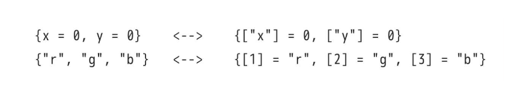

- 数组索引从1开始
- 所有元素都比为nil的数组称为序列，#a获取序列a的长度

- 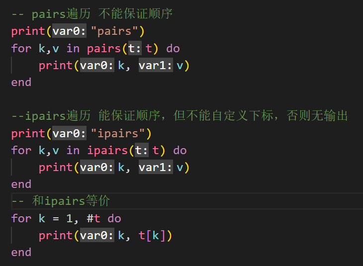

> c#安全访问操作符`?.`：`zip = A?.a`访问A库中的a，如果访问中出现nil则返回nil

- lua中的替代方案：

```lua
E = {}
zip = ((A or E).a or E)
```

# 函数

- 多返回值，如果接收的值少了，多的返回值被丢弃；如果返回值少了，会给接收值nil
- return f()会返回所有返回值，return (f())仅返回第一个返回值

## 变长参数函数

- 函数select总是具有一个固定的参数selector，以及数量可变的参数。如果selector是数值n，那么函数select则返回第n个参数后的所有参数；否则，selector应该是字符串"#"，以便函数select返回额外参数的总数。一下都是add函数，前者适用于元素多的情况，后者反之

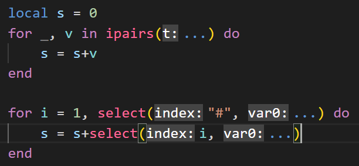

- table.pack/table.unpack

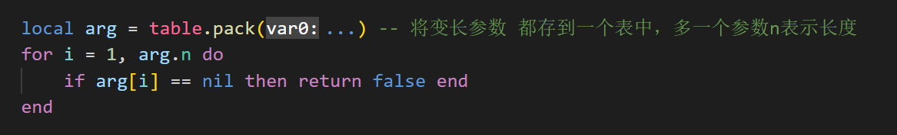

## 尾调用

- 尾调用（tail call）是被当作函数调用使用的跳转。当一个函数的最后一个动作是调用另一个函数而没有再进行其他工作时，就形成了尾调用。尾调用不消耗栈空间，称为尾调用消除。故尾调用可以无限长。只有形如returnfunc（args）的调用才是尾调用。不过，由于Lua语言会在调用前对func及其参数求值，所以func及其参数都可以是复杂的表达式。

# 基本语法

## for

- var 从 exp1 变化到 exp2，每次变化以 exp3 为步长递增 var，并执行一次 **"执行体"**。exp3 是可选的，如果不指定，默认为1。

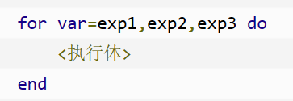

# 输入输出

- print一般用在debug上
- 需要完全控制的输入输出用`io.write`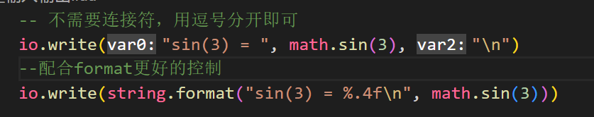

- io.read参数
  - io.read(0)用来测试是否到达了文件末尾，如果有数据可读，返回空字符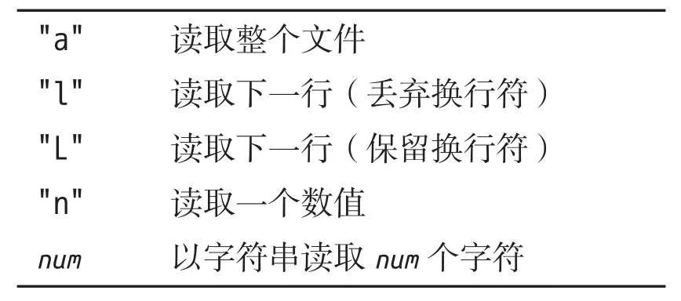

- io.lines("文件名")

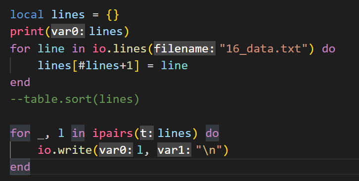

# 第一类值

- Lua语言中的函数与其他常见类型的值（例如数值和字符串）具有同等权限：一个程序可以将某个函数保存到变量中（全局变量和局部变量均可）或表中，也可以将某个函数作为参数传递给其他函数，还可以将某个函数作为其他函数的返回值返回。
- 使用匿名函数排序，求导数的近似。可以看出函数可以当值/参用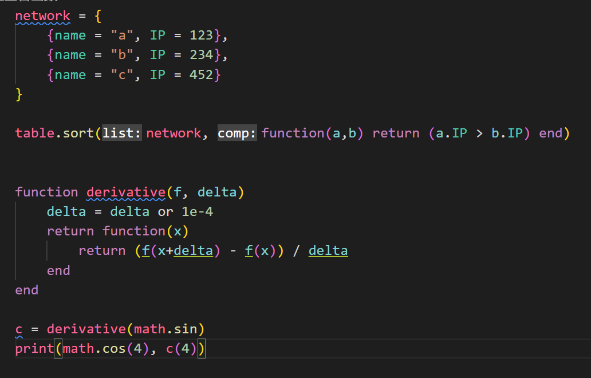

# 面向对象

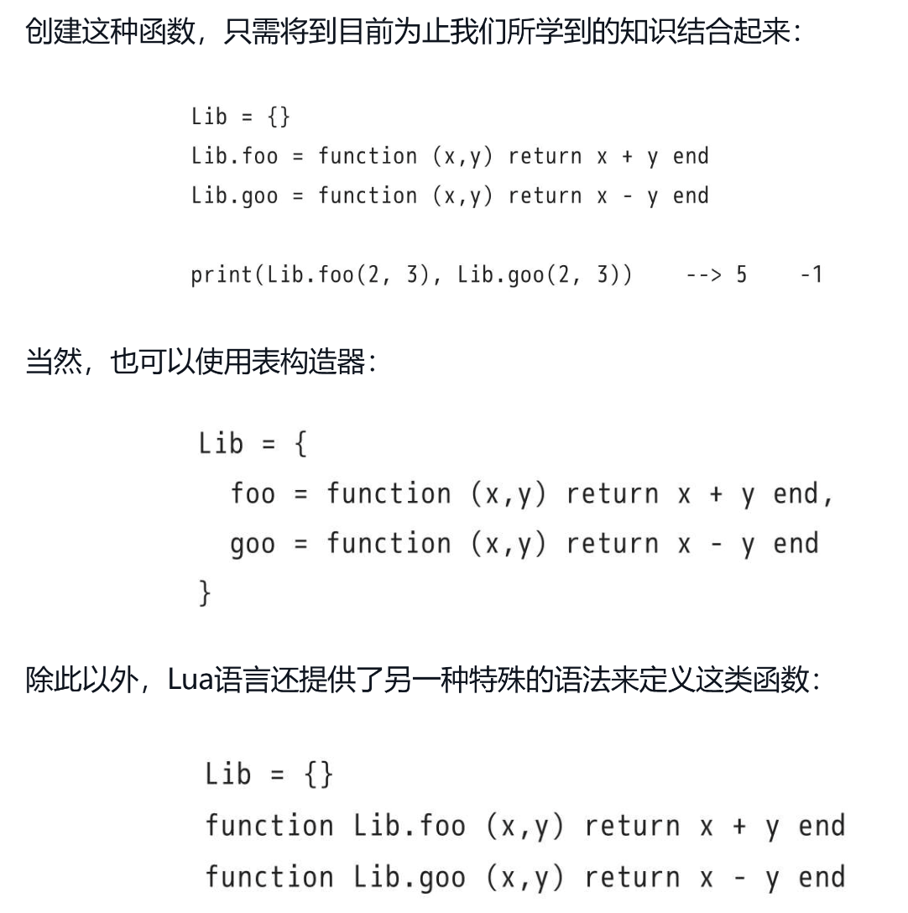

# 词法定界

- Lua语言中的函数可以访问包含其自身的外部函数中的变量（也意味着Lua语言完全支持Lambda演算）

- 局部函数对于包（package）而言尤其有用：由于Lua语言将每个程序段（chunk）作为一个函数处理，所以在一段程序中声明的函数就是局部函数，这些局部函数只在该程序段中可见。词法定界保证了程序段中的其他函数可以使用这些局部函数。

  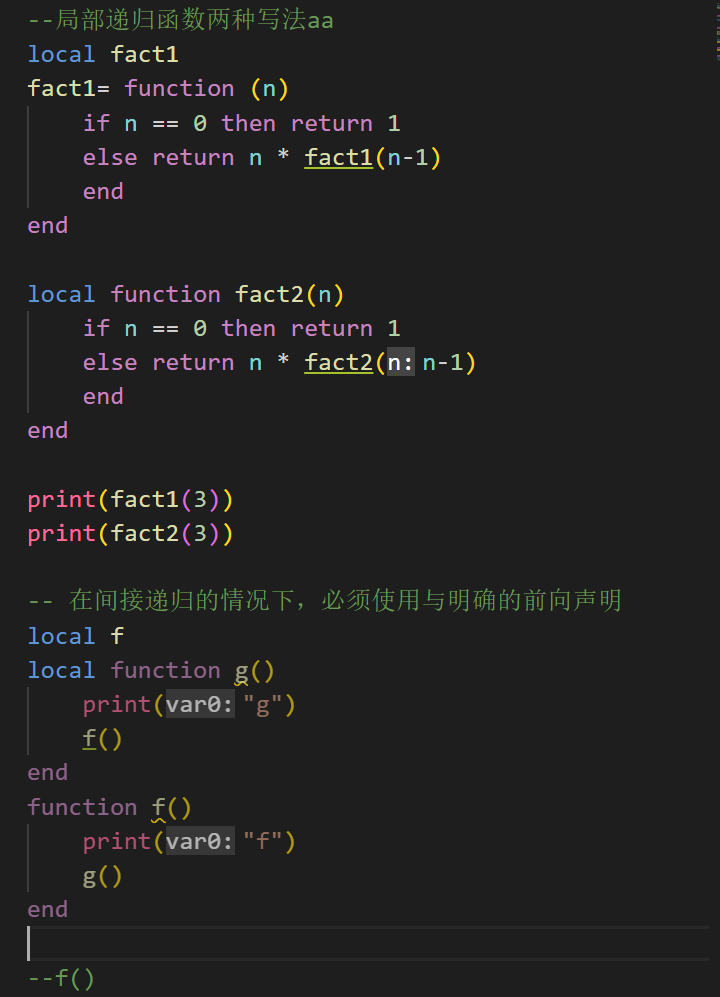

# 闭包

- 一个闭包就是一个函数外加能够使该函数正确访问非局部变量所需的其他机制

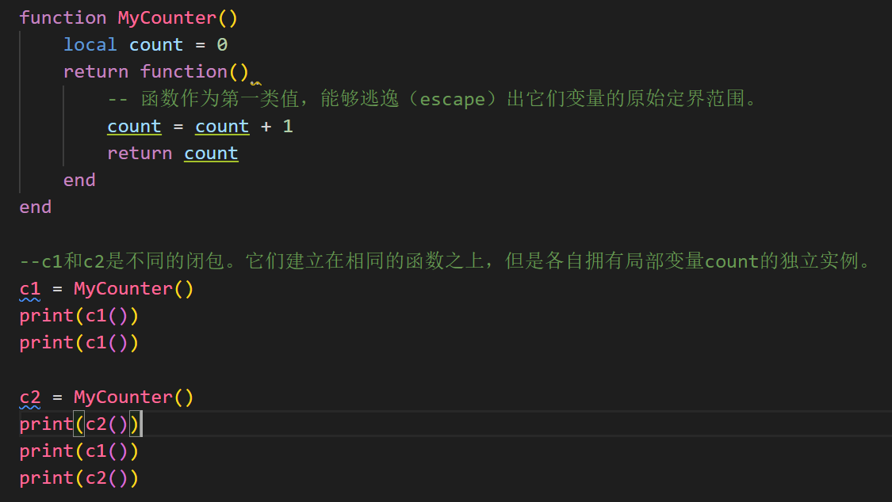

## 用于重定义/预定义

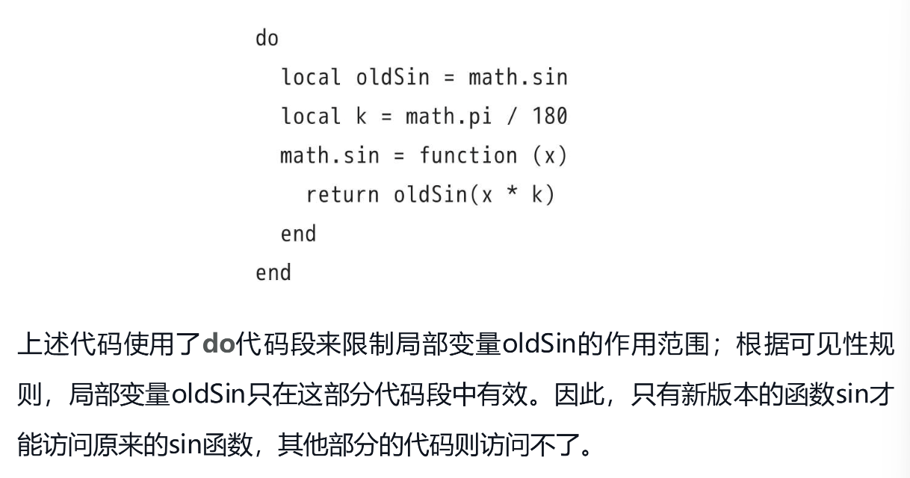

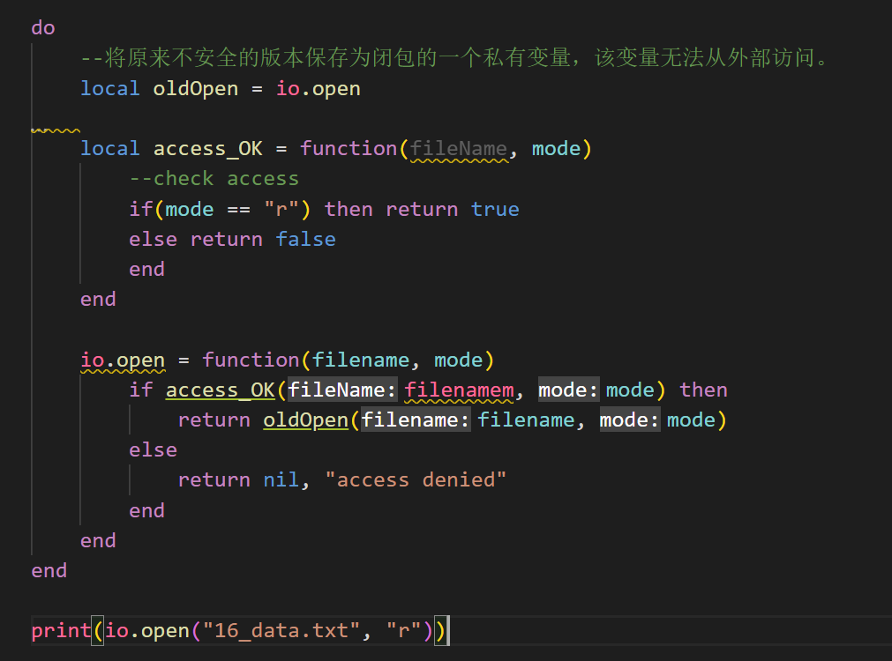

- 一个工厂案例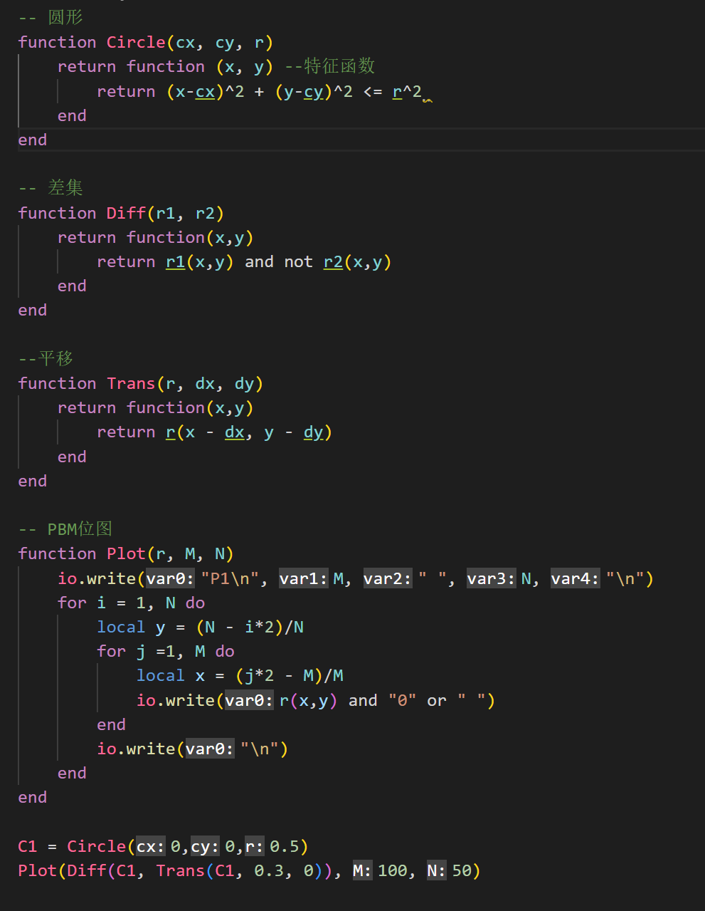
