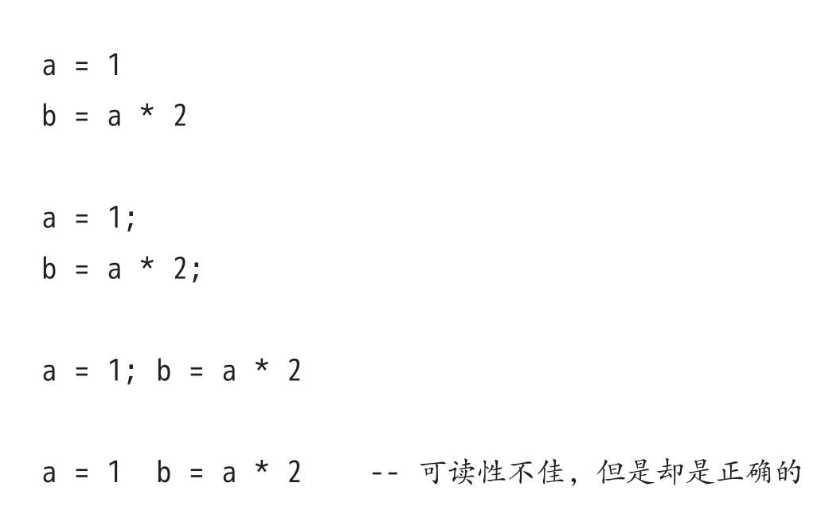

# Lua特性

- 扩展性强
- 简明高效
- 可移植性强

# 保留字

- Lua语言是对大小写敏感的，因而虽然and是保留字，但是And和AND就是两个不同的标识符。

# 注释

# 分隔符

- 在Lua语言中，连续语句之间的分隔符并不是必需的，如果有需要的话可以使用分号来进行分隔。

- 下面的情况等价

# 基本类型

- Lua语言中有8种基本类型：nil（空）、boolean（布尔）、number（数值）、string（字符串）、userdata（用户数据）、function（函数）、thread（线程）和table（表）。

- userdata类型允许把任意的C语言数据保存在Lua语言变量中。