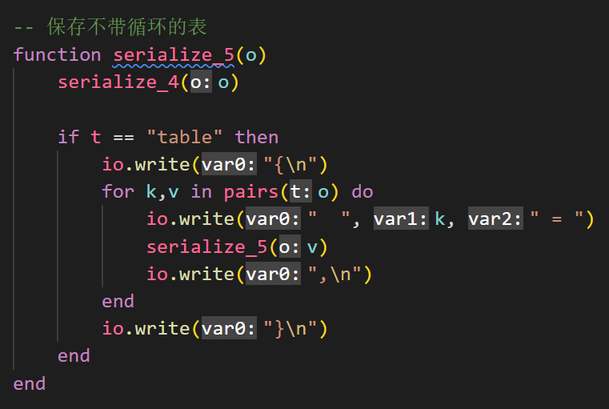
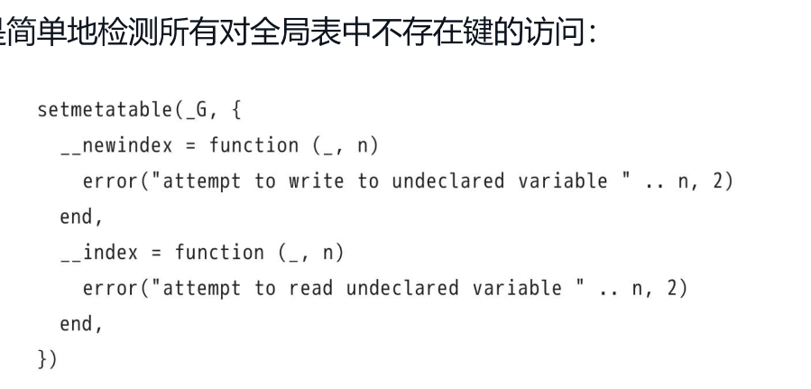

# Lua特性

- 扩展性强
- 简明高效
- 可移植性强

# 保留字


- Lua语言是对大小写敏感的，因而虽然and是保留字，但是And和AND就是两个不同的标识符。

# 注释


# 分隔符

- 在Lua语言中，连续语句之间的分隔符并不是必需的，如果有需要的话可以使用分号来进行分隔。

- 下面的情况等价


# 基本类型

- Lua语言中有8种基本类型：nil（空）、boolean（布尔）、number（数值）、string（字符串）、userdata（用户数据）、function（函数）、thread（线程）和table（表）。

- userdata类型允许把任意的C语言数据保存在Lua语言变量中。

## nil

- 一个全局变量在第一次被赋值前的默认值就是nil，而将nil赋值给全局变量则相当于将其删除。

## boolean

- 在Lua语言中，条件测试（例如控制结构中的分支语句）将除Boolean值false和nil外的所有其他值视为真。特别的是，在条件检测中Lua语言把零和空字符串也都视为真。

## 逻辑运算

- Lua语言支持常见的逻辑运算符：and、or和not。和条件测试一样，所有的逻辑运算将Boolean类型的false和nil当作假，而把其他值当作真。
- 逻辑运算符and的运算结果为：如果它的第一个操作数为“false”，则返回第一个操作数，否则返回第二个操作数。
- 逻辑运算符or的运算结果为：如果它的第一个操作数不为“false”，则返回第一个操作数，否则返回第二个操作数。

## 数值

- 当需要区分整型和浮点型的值，可以用`math.type`

- 整型+0.0=浮点型
- 浮点型|0=整型 或者 math.tointeger


## 运算符

### 优先级


### 结合性

- 在二元运算符中，除了幂运算和连接操作符是右结合的外，其他运算符都是左结合的。

- `x^y^z`等价于`x^(y^z)`

# 字符串

- `#`获取字符串长度，等价于`string.len(s)`
- `..`连接字符串
- 

- 

- 像长注释/多行注释一样，可以使用一对双方括号来声明长字符串/多行字符串常量。被方括号括起来的内容可以包括很多行，并且内容中的转义序列不会被转义。

- 字符串和数字可以自动转换
- 字符串显示转换为数字：`tonumber("10",10)`，第二个参数为**进制**
- 数字显示转换为字符串：`tostring(10)`

- 重复字符串n次：`string.rep(s,n)`
- 反转字符串：string.reverse(s)
- 全部变小写/大写：`string.lower(s)  string.upper(s)`

- 提取部分字符串：`string.sub(s, i, j)`
  - 对字符串s调用函数string.sub（s,1,j）得到的是字符串s中长度为j的前缀
  - 调用string.sub（s,j,-1）得到的是字符串s中从第j个字符开始的后缀
  - 调用string.sub（s,2,-2）返回的是去掉字符串s中第一个和最后一个字符后的结果
- 字符串和数值转换：` string.char()  string.byte() `
- 函数string.format是用于进行字符串格式化和将数值输出为字符串
- 查找子字符串：`string.find()`
- 替换子字符串：`string.gsub("dada", "a", ".")` ，表示用 . 替换 a

# 表

- 表永远是匿名的，表本身和保存表的变量之间没有固定的关系
- 当程序中不再有指向它的引用时，垃圾收集器会最终删除这个表并重用其占用的内存。

- 同一个表中存储的值可以具有不同的类型索引[插图]，并可以按需增长以容纳新的元素
- 未经初始化的表元素为nil，将nil赋值给表元素可以将其删除。
- 当把表当作结构体使用时，可以把索引当作成员名称使用（a.name等价于a["name"]）。
- 整型和浮点型类型的表索引则不存在上述问题。由于2和2.0的值相等，所以当它们被当作表索引使用时指向的是同一个表元素。更准确地说，当被用作表索引时，任何能够被转换为整型的浮点数都会被转换成整型数。

- 表的构造

  - 记录式：`a = {x = 1, y = 2}`
  - 列表式：`a = {"a","b","c"}`
  - 混用两者：`a = {x = 1, {m = 0, n = 1}}`，这也是创建嵌套表（和构造器）以表达更加复杂的数据结构的方法。
  - 使用这两种构造器时，不能使用负数索引初始化表元素[插图]，也不能使用不符合规范的标识符作为索引。
  - 一种更加通用的构造器，即通过方括号括起来的表达式显式地指定每一个索引：`a = {["-"] = "sub", ["+"] = "add"}`

  - 方括号构造器和其他构造器的转换

- 数组索引从1开始
- 所有元素都比为nil的数组称为序列，#a获取序列a的长度

- 

> c#安全访问操作符`?.`：`zip = A?.a`访问A库中的a，如果访问中出现nil则返回nil

- lua中的替代方案：

```lua
E = {}
zip = ((A or E).a or E)
```

# 函数

- 多返回值，如果接收的值少了，多的返回值被丢弃；如果返回值少了，会给接收值nil
- return f()会返回所有返回值，return (f())仅返回第一个返回值

## 变长参数函数

- 函数select总是具有一个固定的参数selector，以及数量可变的参数。如果selector是数值n，那么函数select则返回第n个参数后的所有参数；否则，selector应该是字符串"#"，以便函数select返回额外参数的总数。一下都是add函数，前者适用于元素多的情况，后者反之


- table.pack/table.unpack


## 尾调用

- 尾调用（tail call）是被当作函数调用使用的跳转。当一个函数的最后一个动作是调用另一个函数而没有再进行其他工作时，就形成了尾调用。尾调用不消耗栈空间，称为尾调用消除。故尾调用可以无限长。只有形如returnfunc（args）的调用才是尾调用。不过，由于Lua语言会在调用前对func及其参数求值，所以func及其参数都可以是复杂的表达式。

# 基本语法

## for

- var 从 exp1 变化到 exp2，每次变化以 exp3 为步长递增 var，并执行一次 **"执行体"**。exp3 是可选的，如果不指定，默认为1。


# 输入输出

- print一般用在debug上
- 需要完全控制的输入输出用`io.write`

- io.read参数
  - io.read(0)用来测试是否到达了文件末尾，如果有数据可读，返回空字符

- io.lines("文件名")


# 第一类值

- Lua语言中的函数与其他常见类型的值（例如数值和字符串）具有同等权限：一个程序可以将某个函数保存到变量中（全局变量和局部变量均可）或表中，也可以将某个函数作为参数传递给其他函数，还可以将某个函数作为其他函数的返回值返回。
- 使用匿名函数排序，求导数的近似。可以看出函数可以当值/参用

# 面向对象


# 词法定界

- Lua语言中的函数可以访问包含其自身的外部函数中的变量（也意味着Lua语言完全支持Lambda演算）

- 局部函数对于包（package）而言尤其有用：由于Lua语言将每个程序段（chunk）作为一个函数处理，所以在一段程序中声明的函数就是局部函数，这些局部函数只在该程序段中可见。词法定界保证了程序段中的其他函数可以使用这些局部函数。

  

# 闭包

- 一个闭包就是一个函数外加能够使该函数正确访问非局部变量所需的其他机制


## 用于重定义/预定义


- 一个工厂案例

# 模式匹配

- `string.find`：返回两个值：匹配到模式开始位置的索引和结束位置的索引。如果没有找到任何匹配，则返回nil。第3个参数是一个索引，用于说明从目标字符串的哪个位置开始搜索。第4个参数是一个布尔值，用于说明是否进行简单搜索

- `string.match`：返回的是目标字符串中与模式相匹配的那部分子串
- `string.gsub`：有3个必选参数：目标字符串、模式和替换字符串（replacementstring），其基本用法是将目标字符串中所有出现模式的地方换成替换字符串，可选的第4个参数，用于限制替换的次数。返回第2个结果，即发生替换的次数。第3个参数也可以是一个函数或一个表，这个函数或表会被调用（或检索）以产生替换字符串
- `string.gmatch`：返回一个函数，通过返回的函数可以遍历一个字符串中所有出现的指定模式。

## 转义

- 所有被转义的字母都具有某些特殊含义（例如'%a'匹配所有字母），而所有被转义的非字母则代表其本身

- 这些类的大写形式表示类的补集。例如，'%A'代表任意非字母的字符

- 魔法字符
  - `[0-5]`：表示匹配0-5
  - `[^0-5]`：表示匹配非0-5
- 修饰符
  - 模式'%a+'代表一个或多个字母（即一个单词）
  - 模式'%d+'匹配一个或多个数字（一个整数）
  - '.*'会尽可能长地匹配[插图]，因此程序中的第一个"/*"只会与最后一个"*/"相匹配；模式'.-'则只会匹配到找到的第一个"*/"
  - 以补字符^开头的模式表示从目标字符串的开头开始匹配。类似地，以$结尾的模式表示匹配到目标字符串的结尾。
- 模式'%b'匹配成对的字符串，它的写法是'%bxy'，其中x和y是任意两个不同的字符，x作为起始字符而y作为结束字符。
- 模式'%f[char-set]'代表前置模式（frontier pattern）。该模式只有在后一个字符位于char-set内而前一个字符不在时匹配一个空字符串

# 时间

- os.date参数


- `os.time(os.date("*t",t)) == t`

# 位和字节

## 位运算

- & 与
- | 或
- ~ 异或
- \>> 逻辑右移 
- \<< 逻辑左移
- ~ 按位取反

## 无符号整型数

- 函数math.ult（unsigned less than）：比较无符号整数的大小

## 打包/解包二进制数据

- 在二进制数和基本类型值（数值和字符串类型）之间进行转换的函数。函数string.pack会把值“打包（pack）”为二进制字符串，而函数string.unpack则从字符串中提取这些值。

- 函数string.pack会把值“打包（pack）”为二进制字符串，而函数string.unpack则从字符串中提取这些值。

- 对于编码一个整型数而言有几种选项，每一种对应了一种整型大小：b（char）、h（short）、i（int）、l（long）和j（代表Lua语言中整型数的大小）。要是使用固定的、与机器无关的大小，可以在选项i后加上一个1～16的数。
- 用3种表示形式打包字符串：\0结尾的字符串、定长字符串和使用显式长度的字符串。\0结尾的字符串使用选项z；定长字符串使用选项cn，其中n是被打包字符串的字节数。显式长度的字符串在存储时会在字符串前加上该字符串的长度。在这种情况下，选项的格式形如sn，其中n是用于保存字符串长度的无符号整型数的大小。
- 对于浮点型数，有3种选项：f用于单精度浮点数、d用于双精度浮点数、n用于Lua语言浮点数。
- 格式字符串也有用来控制大小端模式和二进制数据对齐的选项。在默认情况下，格式使用的是机器原生的大小端模式。选项>把所有后续的编码转换改为大端模式或网络字节序，选项<则改为小端模式，选项=改回机器默认的原生大小端模式
- 对于对齐而言，选项!n强制数据对齐到以n为倍数的索引上。更准确地说，如果数据比n小，那么对齐到其自身大小上；否则，对齐到n上。而选项!（不带数字）则把对齐设为机器默认的对齐方式。
- 函数string.pack通过在结果字符串到达合适索引值前增加0的方式实现对齐，函数string.unpack在读取字符串时会简单地跳过这些补位（padding）。对齐只对2的整数次幂有效

## 二进制文件

- 在读取二进制数据时，要么使用模式"a"来读取整个文件，要么使用模式n来读取n字节

- 像Windows之类的操作系统中，必须用特殊方式来打开二进制文件，即在io.open的模式字符串中使用字母b。

# 数据结构

## 数组


## 矩阵/二维数组


## 链表


## 队列/栈


## 索引表/反向表

- 根据value得到key


## 集合与包

- 集合（类似hash表）：将集合元素作为索引放入表中，对于指定的元素无须再搜索表，只需用该元素检索表并检查结果是否为nil即可。


- 包：类似一个元素计数器


## 字符串缓冲区

- Lua语言中，我们可以把一个表当作字符串缓冲区，其关键是使用函数table.concat，这个函数会将指定列表中的所有字符串连接起来并返回连接后的结果。函数concat还有第2个可选参数，用于指定插在字符串间的分隔符。
- 

## 图


# 序列化和反序列化




## 保存带有循环的table


# 编译和异常


- 函数error还有第2个可选参数level，用于指出向函数调用层次中的哪层函数报告错误，以说明谁应该为错误负责。

# 模块和包

- 一个模块（module）就是一些代码（要么是Lua语言编写的，要么是C语言编写的），这些代码可以通过函数require加载，然后创建和返回一个表。这个表就像是某种命名空间，其中定义的内容是模块中导出的东西，比如函数和常量。


- 一个名为mod.sub的模块是模块mod的一个子模块（submodule）。一个包（package）是一棵由模块组成的完整的树，它是Lua语言中用于发行程序的单位。

# 迭代和闭包

- 一个闭包结构通常涉及两个函数：闭包本身和一个用于创建该闭包及其封装变量的工厂（factory）


# 元表和元方法

- 元表可以修改一个值在面对一个未知操作时的行为。例如，假设a和b都是表，那么可以通过元表定义Lua语言如何计算表达式a+b。当Lua语言试图将两个表相加时，它会先检查两者之一是否有元表（metatable）且该元表中是否有__add字段。如果Lua语言找到了该字段，就调用该字段对应的值，即所谓的元方法（metamethod）（是一个函数）
- 一个表可以成为任意值的元表；一组相关的表也可以共享一个描述了它们共同行为的通用元表；一个表还可以成为它自己的元表，用于描述其自身特有的行为。总之，任何配置都是合法的。
- 


- 
- 标准规定任何涉及NaN的比较都应返回假，这就意味着NaN<=x永远为假，x<NaN也为假。因此，在这种情况下，a<=b到not（b<a）的转化也就不合法了。

## 元方法


## 具有默认值的表


## 跟踪对表的访问

- 跟踪table，是指对一个table 的操作，比如访问和更新进行跟踪。当访问一个 table 或者更新 table 中的某个元素时，lua 首先会在 table 查找是否存在该元素，如果没有，就会查找 table 是否存在 __index(访问) 或者 __newindex(更新) 原方法。

- 以访问为例，首先在 table 中查找某个字段，如果不存在，解释器会去查找 __index 这个原方法，如果仍然没有，返回 nil。所以说，__index 和 __newindex 是在 table 中没有所需访问的 index 时才发挥作用的。

  根据上面这种思路，如果我们想跟踪一个 table 的操作行为，那么需要一个空表，每次对这个空表操作的时候，就会使用 __index 或者 __newindex 这些元方法，在元方法中对原始 table 进行访问和操作，并打印跟踪信息。而之前创建的那个空表，就是代理。

- 假设我们要跟踪对某个表的所有访问。由于__index和__newindex元方法都是在表中的索引不存在时才有用，因此，捕获对一个表所有访问的唯一方式是保持表是空的。如果要监控对一个表的所有访问，那么需要为真正的表创建一个代理（proxy）。这个代理是一个空的表，具有用于跟踪所有访问并将访问重定向到原来的表的合理元方法。


## 只读的表


# 面对对象

- 使用参数self是所有面向对象语言的核心点。Lua语言同样可以使用冒号操作符（colon operator）隐藏该参数。

- 我们可以使用点分语法来定义一个函数，然后用冒号语法调用它，反之亦然，只要能够正确地处理好额外的参数即可


## 原型

- 原型也是一种普通的对象，当对象（类的实例）遇到一个未知操作时会首先在原型中查找。要在这种语言中表示一个类，我们只需要创建一个专门被用作其他对象（类的实例）的原型对象即可。类和原型都是一种组织多个对象间共享行为的方式

## 类


## 继承


## 多重继承


## 实现私有性

- 通过两个表来表示一个对象：一个表用来保存对象的状态，另一个表用于保存对象的操作（或接口）。我们通过第二个表来访问对象本身，即通过组成其接口的操作来访问。为了避免未授权的访问，表示对象状态的表不保存在其他表的字段中，而只保存在方法的闭包中。


- 对偶表示

# 全局变量

- 全局变量存在`_G`表中


- 声明全局变量

**方法1**

这段代码执行后，所有试图对不存在全局变量的访问都将引发一个错误


**方法2**


# 非全局变量


- 通常，_G和_ENV指向的是同一个表。尽管如此，它们是很不一样的实体。_ENV是一个局部变量，所有对“全局变量”的访问实际上访问的都是_ENV。_G则是一个在任何情况下都没有任何特殊状态的全局变量。按照定义，_ENV永远指向的是当前的环境；而假设在可见且无人改变过其值的前提下，_G通常指向的是全局环境。


## 环境和模块

- 模块的缺点之一在于很容易污染全局空间，例如在私有声明中忘记local关键字。环境为解决这个问题提供了一种有趣的方式。一旦模块的主程序块有一个独占的环境，则不仅该模块所有的函数共享了这个环境，该模块的全局变量也进入到了这个环境中。我们可以将所有的公有函数声明为全局变量，这样它们就会自动地进入分开的环境中。模块所要做的就是将这个环境赋值给变量_ENV。


- 为了避免错误地创建全局变量，笔者使用把nil赋给_ENV的方式。在把_ENV设为nil后，任何对全局变量的赋值都会抛出异常。

## 模块之间的访问

- 


- 

## 安全加载文件


# 垃圾回收

- 弱引用表（weak table）、析构器（finalizer）和函数collectgarbage是在Lua语言中用来辅助垃圾收集器的主要机制。弱引用表允许收集Lua语言中还可以被程序访问的对象；析构器允许收集不在垃圾收集器直接控制下的外部对象；函数collectgarbage则允许我们控制垃圾收集器的步长。
