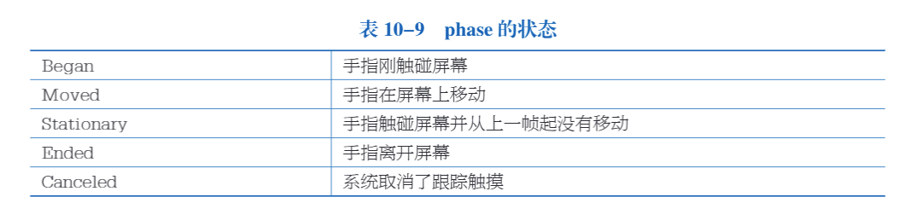

# 常用快捷键

Q：手形工具

W：移动工具

E：旋转工具

R：缩放工具

T：矩形工具

Y：变换工具

F：聚焦

ALT+鼠标左键：以对象为中心旋转（直接用鼠标右键旋转是以当前的视窗旋转）

ALT+鼠标右键：拉近拉远场景距离（鼠标滚轮）

WSADQE+鼠标右键：飞行浏览模式，shift加速

# 3D资源参数

## Model

### Scene

- Scale Factor：缩放系数，矫正不同软件的单位不同问题
- Preserve Hierarchy：是否保留文件层次结构
- Mesh Compression：网格压缩的程度
- Read/Write Enabled：网格是否可以被实时读写
- Optimize Mesh：优化网格

### Meshes

- Keep Quads：保留四边形
- Weld Vertices：合并相同位置的顶点
- Index Format：定义网格索引缓存区的大小

## Rig

设置模型支持动画

## Animation

从模型文件中导入动画

## Materials

从导入的模型中提取和调整材质

Location

- use embedded materials：将导入的材质提取为外部资源
- use external materials：将导入的资源保留在导入的模型中

# 图片资源

## 类型

# 数学

## 旋转表示

## 四元数函数

## 坐标系变换

# 必然事件

# 函数控制符

# 数据结构

## 链表操作

# MonoBehavior类

- unity的脚本都要继承自MonoBehavior

## 访问游戏对象

## 组件

# 常用API

> Yield Return关键字的作用就是退出当前函数，并且会保存当前函数执行到什么地方，也就上下文。你发现没下次执行这个函数上次跑来的代码是不会重复执行的，
>
> 但是你一般的return result 假如你在循环体提前return ,下面调这个函数是会从第一步开始重新执行的。不会记录上次执行的地方。

# 脚本生命周期

# 输入——Input类

# 物理系统
