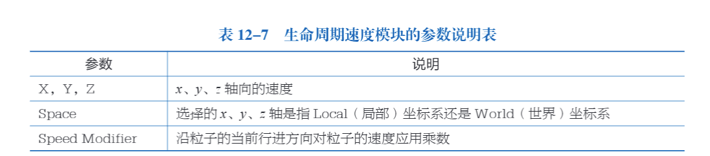
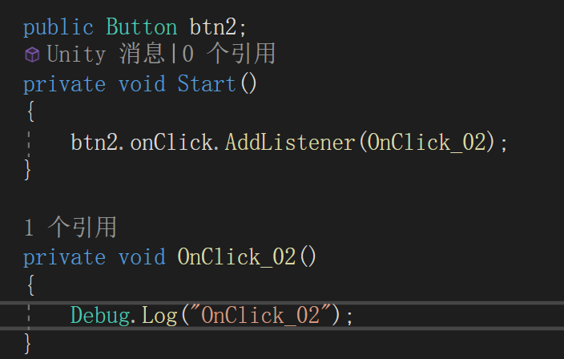
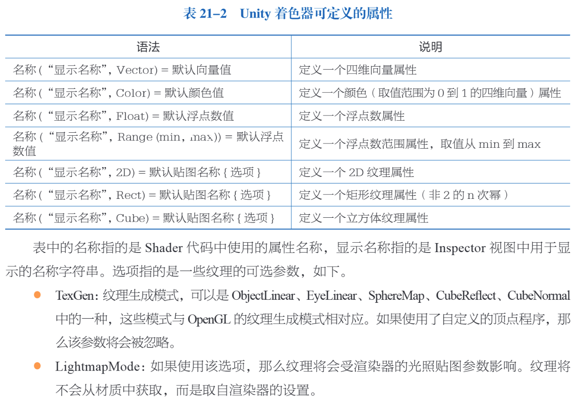
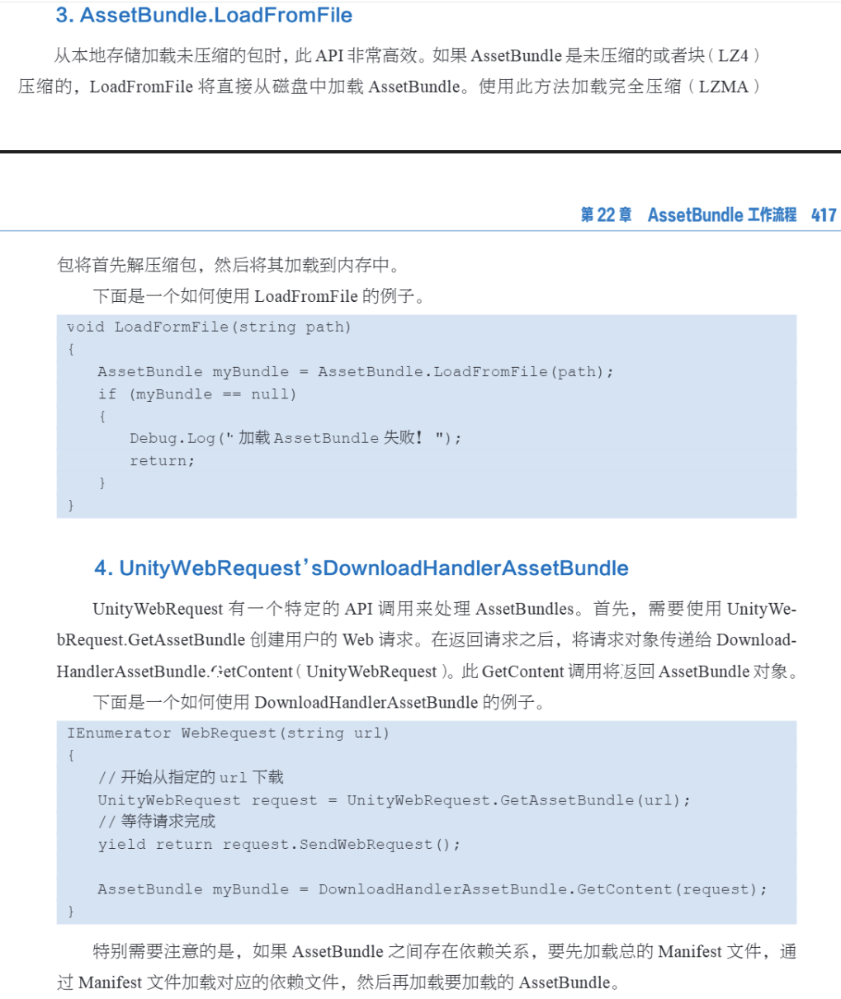
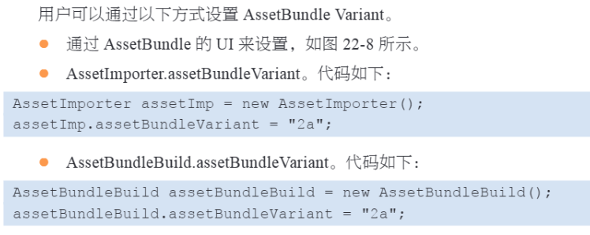

# 常用快捷键

Q：手形工具

W：移动工具

E：旋转工具

R：缩放工具

T：矩形工具

Y：变换工具

F：聚焦

ALT+鼠标左键：以对象为中心旋转（直接用鼠标右键旋转是以当前的视窗旋转）

ALT+鼠标右键：拉近拉远场景距离（鼠标滚轮）

WSADQE+鼠标右键：飞行浏览模式，shift加速

# 3D资源参数

## Model

### Scene

- Scale Factor：缩放系数，矫正不同软件的单位不同问题
- Preserve Hierarchy：是否保留文件层次结构
- Mesh Compression：网格压缩的程度
- Read/Write Enabled：网格是否可以被实时读写
- Optimize Mesh：优化网格

### Meshes

- Keep Quads：保留四边形
- Weld Vertices：合并相同位置的顶点
- Index Format：定义网格索引缓存区的大小

## Rig

设置模型支持动画

## Animation

从模型文件中导入动画

## Materials

从导入的模型中提取和调整材质

Location

- use embedded materials：将导入的材质提取为外部资源
- use external materials：将导入的资源保留在导入的模型中

# 图片资源

## 类型

# 数学

## 旋转表示

## 四元数函数

## 坐标系变换

# 必然事件

# 函数控制符

# 数据结构

## 链表操作

# MonoBehavior类

- unity的脚本都要继承自MonoBehavior

## 访问游戏对象

## 组件

# 常用API

> Yield Return关键字的作用就是退出当前函数，并且会保存当前函数执行到什么地方，也就上下文。你发现没下次执行这个函数上次跑来的代码是不会重复执行的，
>
> 但是你一般的return result 假如你在循环体提前return ,下面调这个函数是会从第一步开始重新执行的。不会记录上次执行的地方。

# 脚本生命周期

# 输入——Input类

# 物理系统

## 物理材质

# 粒子系统

## 主模块

## 发射模块

## 形状模块

发射粒子的形状

## 生命周期速度模块

## 生命周期速度限制模块

## 速度继承模块

- 例子随着时间推移，速度对于父对象运动的反应

## 生命周期模块

## 速度模块

## 外部力量模块

## 噪声模块

## 碰撞模块

- 控制粒子和场景中的对象碰撞

## 触发模块

## 子发射器模块

## 纹理动画模块

## 灯光模块

## 拖尾模块

- 为粒子添加拖尾特效

## 自定义数据模块

## 渲染模块

# 动画

## Aratar

- 骨骼

## Muscle

- 用于设置骨骼运动范围，模拟肌肉

## 动画混合

- 混合树
  - 1D
  - 2D
  - 直接混合

# Timeline

- 创建一个TimelineAssit会影响到他的每一个TimelineInstance

# UGUI

## 添加按钮事件的4种方式

- 写好回调函数直接在button onclick列表添加

- 脚本监听

- 通过Trigger组件，类似方法1

- 继承自对应的类接口实现事件的监听

# Nav Mesh

# Shader

## 属性

## 子渲染器

# Asset Bundle

- 游戏运行时对资源的动态下载和加载

- Bundle的依赖关系unity会自动解决

## AssetBundle下载

## AssetBundle的加载

## Bundle Variant

## 卸载Bundle

#  网络

授权服务器：客户端告诉服务端自己要做什么，而服务端做完返回给客户端

非授权服务器：客户端完成逻辑，服务端仅作消息的转发

## HLAPI

## TLAPI传输层API

- 直接使用传输层的工作流程

## 网络组件

- Network Animator：同步网格动画
- Network Discovery：允许使用网络系统的unity应用程序再本地网络上找到彼此
- Network Identity：控制对象的网络身份
- Network Lobby Manager：游戏大厅
- Network Lobby Player：存储大厅每个玩家的状态
- Network Manager：允许用户控制网络游戏的状态
- Network Manager HUD：提供方便的网络服务的UI
- Network Proximity Checker：基于玩家的近邻度控制网络客户端的GameObjects的可见性
- Network Start Position：新的游戏对象创建的位置
- Network Transform：同步网络中的Gameobject的移动和旋转
- Network Transform Child：将GameObject的子对象的变换和Network Transform组件同步
- Network Transform Visualizer：可视化Network Transform

## Unity的网络请求

P470

- 书籍和2019版本不太一致，日后学习

# 编辑器窗口

- Editor文件夹下写内容即可

# Inspector自定义

## Scene自定义

# 脚本调试和优化

- profiler查看性能消耗

## 各平台通用优化手段

- 使用FixedUpdate不要写太多无需重复调用的代码
- 不需要Update函数应该删除，不在Update中执行Find类函数，可以在Start保存变量使用
- 引用一个游戏对象的逻辑，可以在最开始的地方定义它
- 当一个程序不需要每帧执行，可以使用协程。定时重复可以使用InvokeRepeating
- 减少使用临时变量，特别是Update
- 在游戏暂停或者切换场景的时候可以主动进行垃圾回收`System.GC.Collection()`
- 优化数学计算

## 移动设备的优化

- 物理性能

- 脚本性能

# 跨平台发布

